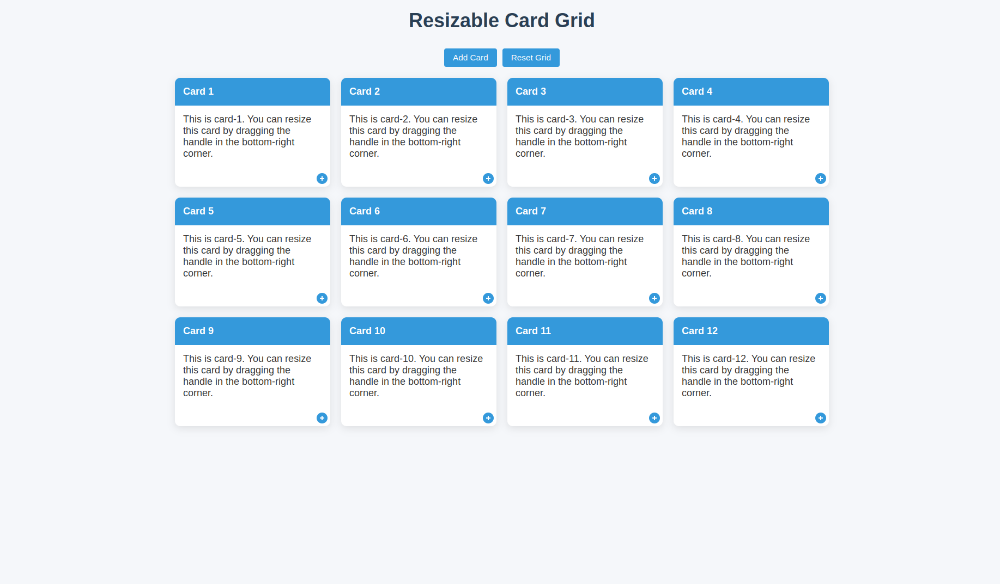

# ResizeRover 🌟

## Overview

ResizeRover is an interactive, dynamic card grid application built with React and TypeScript. It allows users to create, resize, and manage cards in a flexible grid layout with intuitive drag-and-resize functionality.



## 🚀 Features

- **Dynamic Card Grid**: Easily create and manage cards
- **Resizable Cards**: Drag the bottom-right handle to resize cards
- **Responsive Design**: Adapts to different screen sizes
- **Real-time Size Indicator**: Shows current card dimensions during resizing
- **Add/Reset Functionality**: Quickly add new cards or reset the entire grid

## 🛠 Technologies Used

- React
- TypeScript
- CSS Grid
- Custom React Hooks

## 📦 Prerequisites

- Node.js (v14 or later)
- npm (v6 or later)

## 🔧 Installation

1. Clone the repository:

```bash
git clone https://github.com/jahid-bd/resize-rover
cd resizeover
```

2. Install dependencies:

```bash
npm install
```

3. Start the development server:

```bash
npm start
```

## 🎮 Usage

### Adding Cards

- Click the "Add Card" button to create a new card
- Each card can be resized by dragging its bottom-right handle

### Resizing Cards

- Hover over the bottom-right circular handle
- Click and drag to resize the card
- A size indicator will show the current grid span

### Resetting Grid

- Click the "Reset Grid" button to clear all cards and start over

## 🧩 Project Structure

```
src/
├── components/
│   ├── Card.tsx           # Individual card component
│   └── ResizeHandle.tsx   # Resize handle component
├── hooks/
│   └── useResize.ts       # Custom resize hook
├── styles/
│   └── index.css          # Global styles
├── App.tsx                # Main application component
└── index.tsx              # Entry point
```

## 🤝 Contributing

1. Fork the repository
2. Create your feature branch (`git checkout -b feature/AmazingFeature`)
3. Commit your changes (`git commit -m 'Add some AmazingFeature'`)
4. Push to the branch (`git push origin feature/AmazingFeature`)
5. Open a Pull Request

## 🔬 Customization

You can easily customize the grid by modifying:

- Grid item dimensions in `useResize.ts`
- Styling in `index.css`
- Card content in `Card.tsx`

## 📝 License

Distributed under the MIT License. See `LICENSE` for more information.

## 🌈 Contact

Jahid Hasan - [jahidbd9x@gmail.com]

Project Link: [https://github.com/yourusername/resizeover](https://github.com/yourusername/resizeover)

---

**Created with ❤️ by [Your Name]**
